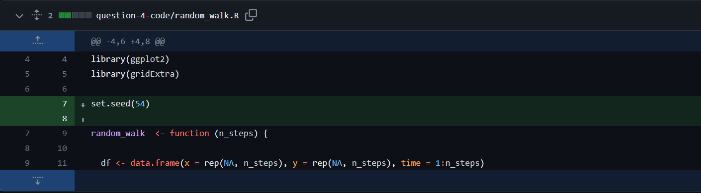

# Reproducible research: version control and R

Link to my logistic-growth repo, containing the answers to questions 1, 2 and 3: https://github.com/1431293/logistic_growth

Question 4
----------
-Part 1

Upon opening the code, my first move after installing and loading the two libraries was to read through it. 

The random_walk() function interested me, as I hadn't seen a lot of the lines within in before, mainly the ones regarding the dataframe manipulations. All I could really figure out was that there seemed to be some kind of random movement being coded for through use of steps and angles, and there were indexes and for loops used. 

I was able to understand the creation of the plots quite well. They seem to be two identically coded plots, the only difference being the dataframe used. The dataframes also seem to be generated the same way by using the newly created random_walk() function on the input 500. Though I still didn't quite understand what the random_walk() function would result in, I had a feeling there would be some kind of movement of a point on a graph. And finally, I knew that the last line (grid.arrange(plot1, plot2, ncol=2)) would place the two plots side by side. 

Having decided my first impressions of the code, I ran it. What was outputted was somewhat like a more complicated version of what I had expected. I had expected a slightly shorter walk, and the colouring by time took me by surprise. As I expected, the two graphs were completely different, and each time I ran the code, different graphs were outputted for both walks. I had expected this from the name of the function, but I still wasn't sure what caused the randomness. 

However, I was now able to figure out a bit more about the code. I realised from the time legend, the input of 500 into random_walk(), and the n_steps parameter while defining the function, that each particle took 500 steps on the graph. Changing this input allowed me to study the graph better. When I changed it to only 10 steps, I realised that the point started at (0,0) each time, and could move in any direction and seemingly any distance (within a certain range). I also realised that the particles move 1 step per time unit, so I assume time is just a proxy used to show the particle's path. 

A two-dimensional datafram seemed to be set up through defining df[1,], where the first value was 1, and the second value was undefined. Beyond this, I really didn't understand the definition of the dataframes in the function definition, so I moved onto the for loops. I could see that the loops were being repeated, starting at 2, incrementing by 1 (using the i as an index) up until the number of steps (which was 500 in the original code) was reached. That meant the for loop ran once per step the particles took, and so that must be what was generating each random step. Specifically, the for loop must be generating the random angle. The runif() function was setting a minimum and maximum for the angle of the particle, and then this was used in a couple of alterations to dataframes. Whatever number within the minimum and maximum was then altered by either the sine or cosine function and multiplied by 0.25. I realised in the following lines of code that 3 different arrays in the same dataframe had been set up, denoted by the second numbers in the df[,], where the second number defined the array and the first number defined the step of the particle. I also noticed that the arrays/index were being incremented each time the for loop was run, to allow the correct number of steps to be defined. 

Finally, the dataframe was returned from the function. I hypothesised that the output would be a dataframe containing three different two dimensional arrays, where the first two would be df[500 random angles, 1] and df[500 random angles, 2], and the third would just seem to be df[numbers 1-100, 3]. 

To test this, I set the number of steps to 10, and just loaded data1. I found that I was slightly incorrect - while I was right in thinking the first two arrays created n random angles while the third counted 1-n steps, 
I found that these were combined. The resulting output was 2 random angles labelled 'x' and 'y', along with an index keeping track that was labelled 'time'. One thing I misunderstood was that I had assumed the code generated a random angle and distance, rather than what it was actually doing: generating a random co ordinate for the particle to travel to each step. 

From there, all I had to do was a bit of research to understand how the dataframe was being defined, and what the runif() function did. Whereas I had assumed it was creating an if loop (I had read it as "run if"), it was actually generating a random number for the 'angle' variable (instead being read as "random uniform") within the bounds of 0 and 2*pi. I now understood all of the code, and how it generated the two graphs. 

-Part 2

I had vaguely heard the term "random seed" before. I knew it was used in coding, and was used to generate some kind of random number - in the video game Minecraft, worlds are generated through the use of random seeds, which appear to be random generated numbers. Beyond this, I knew nothing, so I had to research. 

I learnt quickly that "random seeds" are numbers used to generate other, partially random numbers. If you put the random seed into a pseudorandom number generator, a seemingly random number will be outputted. If you put in a different number, you get a different output. However, putting the same initial seed into the number generator will output the same number each time. Thus, the number generator used is not random, but putting the random seed through an algorithm to produce a certain value. However, for all intents and purposes, the number outputted is random as is treated in experiments as if it is randomly generated. Many coding languages/programs that can generate 'random' numbers, R included, don't actually generate random numbers but generate a pseudorandom number by running an initial value through an algorithm. If you pass the same initial value through the algorithm, the same number is produced. Thus, if you actively choose to set an initial value, you can get the same 'randomly generated' number on purpose, and this initial value is the random seed. In a way, it's like sowing a 'seed' to receive a 'random' number. 

The most important use of this is in experiments requiring randomly generated numbers, such as neural network modelling, where it may be used for random parameter generation, random example sampling or random generation of neurons (1). By use of random seeds and pseudorandom number generators, it makes the randomness reproducible. This means that when an experiment is being repeated or tested by others, if the same random seed is inputted, the same output should be received, and this introduces reproducibilty by allowing the code/outputs to be checked.

1. Reference: Madhyastha, P. and Jain, R. (2019). On Model Stability as a Function of Random Seed. [online] arXiv.org. doi:https://doi.org/10.48550/arXiv.1909.10447.

-Part 3/4

All I had to do to make the code reproducible was to set a seed at the beginning. This meant that the same initial number was fed into the pseudorandom generator, and so runif() produced the same numbers and the same paths resulted each time I ran the code. Paths 1 and 2 weren't the same, because the algorithm generated their two values at the same time through different equations (one used sine and the other used cosine), however, every path 1 was the same and every path 2 was the same. 

Question 5
----------

-Part 1

There are 13 columns in the table and, not including the header, 33 rows. 

-Part 2

The relationship between the virion volume and genome length is at first exponential, which is suggested by the equation: the genome length has to be put to the power of _a_ to find the virion volume, but upon log transforming both variables, the relationship became nicely linear. 

-Part 3

The exponent and scaling factor can be calculated through use of the natural log: 
V = _B_L^_a_ can first be transformed to ln(V) = ln(_B_L^_a_), which then becomes ln(V) = ln(_B_) + _a_ ln(L). This now resembles a linear line equation, tying back to the previous part of the question, and allows us to find the exponent and scaling factor through use of a linear model. We can use the lm() function in R to do this. When we specify the relationship as log(Virion.volume..nm.nm.nm.)~log(Genome.length..kb.), the model outputs the intercept and coefficient. If we think of ln(V) = ln(_B_) + _a_ ln(L) in the form of y = b + mx, substituting log(Virion.volume..nm.nm.nm.) as y and log(Genome.length..kb.) as x, it becomes clear that ln(_B_) is the intercept and _a_ is the gradient. Calling the linear model returns the intercept as 7.075 and the gradient as 1.515. 1.515 is our _a_ value, but 7.075 is ln(_B_), so we only need to raise this to _e_ to find that _B_ is approximately 1182. Placing this into our original equation means that the exponential relationship between virion volume and genome length is V = 1182L^1.515

The summary of the linear model shows the P value for the intercept (log_B_) to be 2.28e-10, and the gradient (_a_) to be 6.44e-10. Both of these are definitely significant at a significance level of 0.05, and so there is strong scientific evidence that there is a linear relationships between the natural logs of virion volume and genome length, and thus an exponential relationship between the virion volume and genome length. 

The 95% CI found for the exponent is the range 1.26-1.6, for which 1.515 falls within. The 95% CI for the scaling factor was 1185-3571, but 1182 falls just slightly outside of this, so my result for the exponent does match the paper but my result for scaling factor doesn't. 

-Part 4

The R code to produce this is in my reproducible-research-homework repo. 

-Part 5

The estimated volume of a 300kb dsDNA virus, using the values in Table 2 of the paper, would be 1182 * 300^1.52 = approximately 6884014 nm3. 

Bonus

Whilst reproducibility and replicability are both concerned with repeating experiments to find the same results, generally, reproducibility suggests the use of the same dataset and resources to find the same trend, whereas replicability is more centred around using different data/resources/equipment to find the same trend. Put differently, a reproducible experiment would be one where it is easy to obtain the same results when the same data is input. A replicable experiment would be one where the same trend is found in different data. 

For example, in an experiment where there was a link found between age and lung cancer rates in British men, the experiment would be reproducible if it was tested again using the same equipment, same methods, and same analyses. However, it would be replicable if the experiment was redone in British women, or American men, or another demographic, and the same trend was found. 

Git and GitHub can increase the reproducibility of research by allowing the sharing of files, code, and data. This means other scientists can have access to the same resources used in the original experiment and in the same format, to recreate it as closely as possible. Forking is critical for reproducibility, as it allows the transfer of data without any manual copying across, which could cause formatting errors, corruption, or forgotten data. 
GitHub increases the replicability of research through the possibility to edit code and files, and through the preservation of past files. This opens up the possibility of editing code multiple times over to change inputs and parameters, without the need to return code to its original state or save multiple copies. 

Overall, there is a lot of crossover between reproducibility and replicability. However, to sum each up, I would say that reproducibility is concerned with achieving consistent results, and replicability is concerned with achieving widely applicable results. Both of these are increased by the fact that GitHub allows file sharing, README files/descriptions and forking. 

Git and Github both share limitations that are found across many data sharing/storing programs. A general limitation is the restriction of file sizes and repository sizes. Though this is difficult to overcome technically, it can still cause issues during large research projects, during which repositories may be fragmented, leading to confusion and a higher rate of errors. Another general concern is security: many programs have the potential for security threats, and GitHub is no exception, particularly the free version. Though it tries to mediate this through mandatory strong passwords and branch protection, it is always possible that a software vulnerability may be exploited and sensitive data accessed. This is especially a threat for scientific research. Speaking of which, Git/GitHub are primarily software/coding oriented, and while this forms a crucial part of scientific research, they aren't specialised for this. Programs such as protocols.io exist which are more tailored towards science than towards software, and these may be preferred over a non-specific software website.

Despite the limitations I have discussed, Git and GitHub are very popular among scientists, and for good reason. Though not specialised towards science, there is a lot of crossover between the properties and protocols necessary for proper scientific research, and those required for software development, and reproducibility/replicability are good examples of this. 

## Instructions

The homework for this Computer skills practical is divided into 5 questions for a total of 100 points (plus an optional bonus question worth 10 extra points). First, fork this repo and make sure your fork is made **Public** for marking. Answers should be added to the # INSERT ANSWERS HERE # section above in the **README.md** file of your forked repository.

Questions 1, 2 and 3 should be answered in the **README.md** file of the `logistic_growth` repo that you forked during the practical. To answer those questions here, simply include a link to your logistic_growth repo.

**Submission**: Please submit a single **PDF** file with your candidate number (and no other identifying information), and a link to your fork of the `reproducible-research_homework` repo with the completed answers. All answers should be on the `main` branch.

## Assignment questions 

1) (**10 points**) Annotate the **README.md** file in your `logistic_growth` repo with more detailed information about the analysis. Add a section on the results and include the estimates for $N_0$, $r$ and $K$ (mention which *.csv file you used).
   
2) (**10 points**) Use your estimates of $N_0$ and $r$ to calculate the population size at $t$ = 4980 min, assuming that the population grows exponentially. How does it compare to the population size predicted under logistic growth? 

3) (**20 points**) Add an R script to your repository that makes a graph comparing the exponential and logistic growth curves (using the same parameter estimates you found). Upload this graph to your repo and include it in the **README.md** file so it can be viewed in the repo homepage.
   
4) (**30 points**) Sometimes we are interested in modelling a process that involves randomness. A good example is Brownian motion. We will explore how to simulate a random process in a way that it is reproducible:

   - A script for simulating a random_walk is provided in the `question-4-code` folder of this repo. Execute the code to produce the paths of two random walks. What do you observe? (10 points)
   - Investigate the term **random seeds**. What is a random seed and how does it work? (5 points)
   - Edit the script to make a reproducible simulation of Brownian motion. Commit the file and push it to your forked `reproducible-research_homework` repo. (10 points)
   - Go to your commit history and click on the latest commit. Show the edit you made to the code in the comparison view (add this image to the **README.md** of the fork). (5 points)

5) (**30 points**) In 2014, Cui, Schlub and Holmes published an article in the *Journal of Virology* (doi: https://doi.org/10.1128/jvi.00362-14) showing that the size of viral particles, more specifically their volume, could be predicted from their genome size (length). They found that this relationship can be modelled using an allometric equation of the form **$`V = \beta L^{\alpha}`$**, where $`V`$ is the virion volume in nm3 and $`L`$ is the genome length in nucleotides.

   - Import the data for double-stranded DNA (dsDNA) viruses taken from the Supplementary Materials of the original paper into Posit Cloud (the csv file is in the `question-5-data` folder). How many rows and columns does the table have? (3 points)
   - What transformation can you use to fit a linear model to the data? Apply the transformation. (3 points)
   - Find the exponent ($\alpha$) and scaling factor ($\beta$) of the allometric law for dsDNA viruses and write the p-values from the model you obtained, are they statistically significant? Compare the values you found to those shown in **Table 2** of the paper, did you find the same values? (10 points)
   - Write the code to reproduce the figure shown below. (10 points)

  

     
  

  - What is the estimated volume of a 300 kb dsDNA virus? (4 points)

**Bonus** (**10 points**) Explain the difference between reproducibility and replicability in scientific research. How can git and GitHub be used to enhance the reproducibility and replicability of your work? what limitations do they have? (e.g. check the platform [protocols.io](https://www.protocols.io/)).
